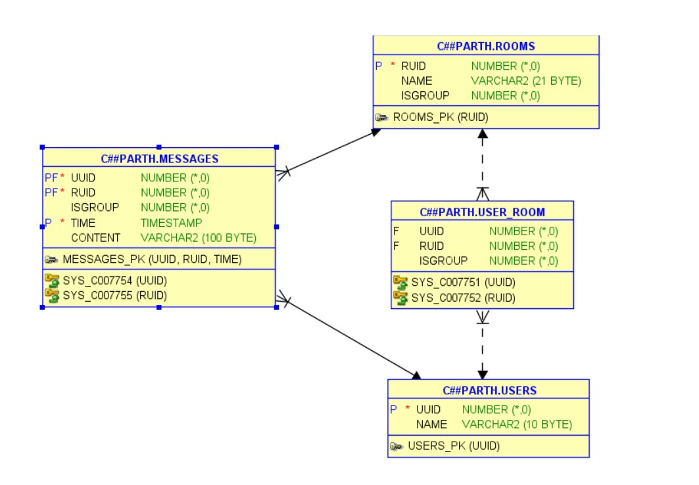

# Wassup
Whatsapp clone 
Using Oracle database
## Entity Relationship Diagram

## DataBase Schema
* USER
  UUID - User Unique ID
* ROOM
  Group chat or Personal chat (determined by ISGROUP)
  RUID - Room Unique ID 

